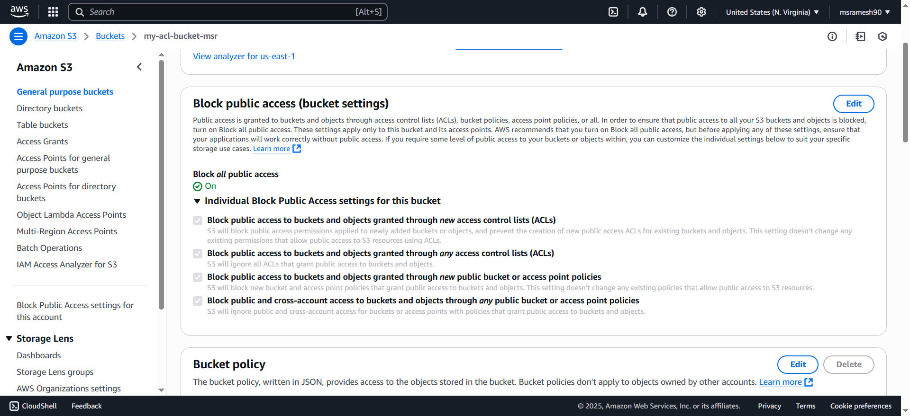

## Create a bucket
```
aws s3api create-bucket --bucket my-acl-bucket-msr --region us-east-1
```
## Steps to create ACL
- Step 1: Allow public access for New ACL and Any ACL
- Step 2: Change Ownership control to Bucket owner preferred or Object Writer
- Step 3: Add another AWS account in the ACL

## Step 1
### Bucket is created with Default to block all public access


### Update Block all public access
```
aws s3api put-public-access-block \
--bucket my-acl-bucket-msr \
--public-access-block-configuration "BlockPublicAcls=false,IgnorePublicAcls=false,BlockPublicPolicy=true,RestrictPublicBuckets=true"
``` 

### Get public access block
```
aws s3api get-public-access-block --bucket my-acl-bucket-msr
```
### Amazon Cli Output
```
{
    "PublicAccessBlockConfiguration": {
        "BlockPublicAcls": false,
        "IgnorePublicAcls": false,
        "BlockPublicPolicy": true,
        "RestrictPublicBuckets": true
    }
}
```

### AWS Management Console


## Step 2:
### Bucket is created by default with Bucket Owner Enforced ownership


### Update Bucket ownership
Directly mention the rule in the CLI
```
aws s3api put-bucket-ownership-controls \
--bucket my-acl-bucket-msr \
--ownership-controls="Rules=[{ObjectOwnership=BucketOwnerEnforced}]"
```
Provide Rules through a JSON file
```
aws s3api put-bucket-ownership-controls \
--bucket my-acl-bucket-msr \
--ownership-controls=file://bucket-ownership-controls.json
```

### Get the Bucket Ownership Controls
```
aws s3api get-bucket-ownership-controls --bucket my-acl-bucket-msr
```

### AWS Cli Output
{
    "OwnershipControls": {
        "Rules": [
            {
                "ObjectOwnership": "BucketOwnerPreferred"
            }
        ]
    }
}

### AWS Management Console


## Step 3
### Default ACL Settings


### Get Bucket ACL
```
aws s3api get-bucket-acl --bucket my-acl-bucket-msr
```

### AWS CLI Output
```
{
    "Owner": {
        "DisplayName": "msrameshcse",
        "ID": "204546020d0bd978c73cfd0f6ed0082d5cdada17b2f36f04ce0a3a45e39165a3"
    },
    "Grants": [
        {
            "Grantee": {
                "DisplayName": "msrameshcse",
                "ID": "204546020d0bd978c73cfd0f6ed0082d5cdada17b2f36f04ce0a3a45e39165a3",
                "Type": "CanonicalUser"
            },
            "Permission": "FULL_CONTROL"
        }
    ]
}
```

### Put Bucket ACL
```
aws s3api put-bucket-acl \
--bucket my-acl-bucket-msr \
--access-control-policy file://access-control-policy.json
```

### Get Bucket ACL
```
aws s3api get-bucket-acl --bucket my-acl-bucket-msr
```

### Output
```
{
    "Owner": {
        "DisplayName": "msrameshcse",
        "ID": "204546020d0bd978c73cfd0f6ed0082d5cdada17b2f36f04ce0a3a45e39165a3"
    },
    "Grants": [
        {
            "Grantee": {
                "DisplayName": "msrameshkumarcse",
                "ID": "282b1541a0bddc571938cae0f5c6a997c3071b6be51aa3a95dcbd4efbaa49458",
                "Type": "CanonicalUser"
            },
            "Permission": "FULL_CONTROL"
        }
    ]
}
```

### AWS Management Console
 


## Upload an object From Other account
```
echo "Welcome Ramesh" > welcome.txt
aws s3api put-object --bucket my-acl-bucket-msr --key welcome.txt --body welcome.txt
```


## Clean up
```
aws s3 rm s3://my-acl-bucket-msr/welcome.txt
aws s3 rb s3://my-acl-bucket-msr