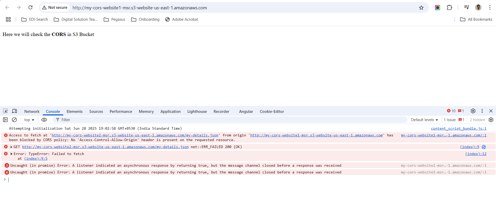
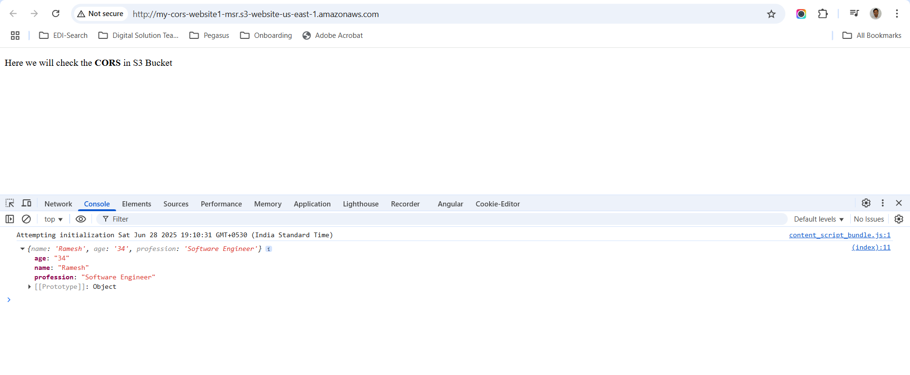

# Hosting Static website 1
## Create bucket
```
aws s3api create-bucket --bucket my-cors-website1-msr
```

## Disable block Public access
```
aws s3api put-public-access-block \
--bucket my-cors-website1-msr \
--public-access-block-configuration "BlockPublicAcls=true,IgnorePublicAcls=true,BlockPublicPolicy=false,RestrictPublicBuckets=false"
```

## Add Bucket Policy to allow public access
```
aws s3api put-bucket-policy --bucket my-cors-website1-msr --policy file://website1/bucket-policy.json
```

## Enable static website hosting
```
aws s3api put-bucket-website --bucket my-cors-website1-msr --website-configuration file://website1/website.json
```

## Upload index.html
```
aws s3 cp website1/index.html s3://my-cors-website1-msr/index.html
```

# Hosting Static website 2
## Create bucket
```
aws s3api create-bucket --bucket my-cors-website2-msr
```

## Disable block Public access
```
aws s3api put-public-access-block \
--bucket my-cors-website2-msr \
--public-access-block-configuration "BlockPublicAcls=true,IgnorePublicAcls=true,BlockPublicPolicy=false,RestrictPublicBuckets=false"
```

## Add Bucket Policy to allow public access
```
aws s3api put-bucket-policy --bucket my-cors-website2-msr --policy file://website2/bucket-policy.json
```

## Enable static website hosting
```
aws s3api put-bucket-website --bucket my-cors-website2-msr --website-configuration file://website2/website.json
```

## Upload a sample.json
```
aws s3 cp website2/my-details.json s3://my-cors-website2-msr/my-details.json
```

## Enable CORS in Website2
```
aws s3api put-bucket-cors --bucket my-cors-website2-msr --cors-configuration file://website2/cors.json
```

## While Accessing Website1 that accesses a resource from Website2 before Enabling CORS in Website2


## While Accessing Website1 that accesses a resource from Website2 after Enabling CORS in Website2


## Cleanup
```
aws s3 rm s3://my-cors-website1-msr/index.html
aws s3 rb s3://my-cors-website1-msr
aws s3 rm s3://my-cors-website2-msr/my-details.json
aws s3 rb s3://my-cors-website2-msr
```