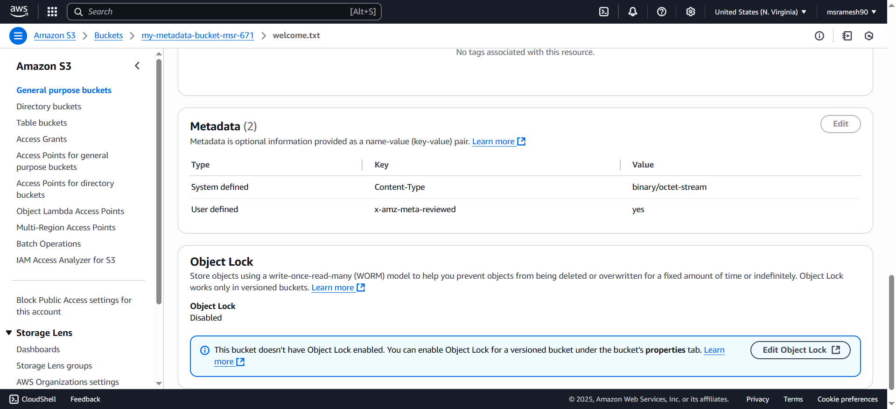

## Create bucket
```
aws s3 mb s3://my-metadata-bucket-msr-671
```

## Put Object with meta data
```
aws s3api put-object --bucket my-metadata-bucket-msr-671 --key welcome.txt --body welcome.txt --metadata author=Ramesh 
```
### output
```
{
    "ETag": "\"83218ac34c1834c26781fe4bde918ee4\"",
    "ChecksumCRC64NVME": "TMlgvI61/Uk=",
    "ChecksumType": "FULL_OBJECT",
    "ServerSideEncryption": "AES256"
}
```

## Check the meta data
```
aws s3api head-object --bucket my-metadata-bucket-msr-671 --key welcome.txt
```

### output
```
{
    "AcceptRanges": "bytes",
    "LastModified": "2025-06-26T03:19:49+00:00",
    "ContentLength": 7,
    "ETag": "\"83218ac34c1834c26781fe4bde918ee4\"",
    "ContentType": "binary/octet-stream",
    "ServerSideEncryption": "AES256",
    "Metadata": {
        "author": "Ramesh"
    }
}
```

## In AWS Console


## Update Metadata
Meta data cannot be updated. </br>
To update through Management console Use Copy > Specify settings)


To update metadata for an S3 object using the AWS CLI, you must re-upload (copy) the object to itself, because metadata is set at the time of upload and cannot be modified directly.

```
aws s3api copy-object \
--bucket my-metadata-bucket-msr-671 \
--key welcome.txt \
--copy-source my-metadata-bucket-msr-671/welcome.txt \
--metadata-directive REPLACE \
--metadata author=Srinandh
```


⚠️ Important: When you use --metadata-directive REPLACE, all existing metadata is replaced. If you want to preserve existing metadata while adding/updating, you must retrieve it first and include it in the command.

```
aws s3api copy-object \
--bucket my-metadata-bucket-msr-671 \
--key welcome.txt \
--copy-source my-metadata-bucket-msr-671/welcome.txt \
--metadata-directive REPLACE \
--metadata reviewed=yes
```


In the AWS S3 API and AWS CLI, there is no alternate to --metadata-directive REPLACE when modifying metadata. This is a limitation of how S3 handles object metadata — metadata is immutable after upload, and any change requires a full copy operation with metadata replacement. </br></br>
⚠️ Why This Limitation Exists: </br>
- S3 does not support partial updates to metadata.</br>
- If you want to update just one key, you still have to supply the full metadata set and use --metadata-directive REPLACE.

## Clean up
```
aws s3 rm s3://my-metadata-bucket-msr-671/welcome.txt
aws s3 rb s3://my-metadata-bucket-msr-671
```